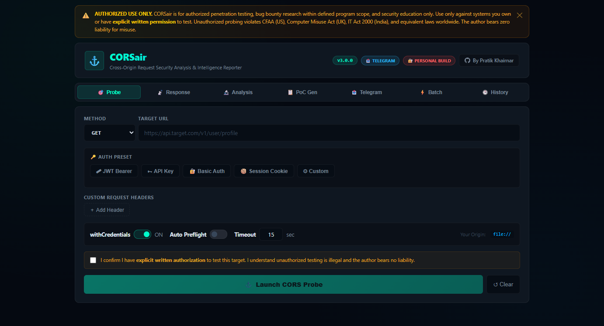
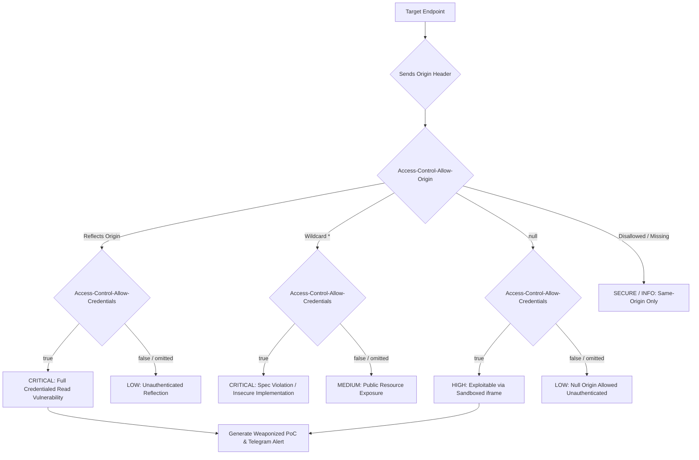

<div align="center">

```text
  ██████╗ ██████╗ ██████╗ ███████╗ █████╗ ██╗██████╗ 
 ██╔════╝██╔═══██╗██╔══██╗██╔════╝██╔══██╗██║██╔══██╗
 ██║     ██║   ██║██████╔╝███████╗███████║██║██████╔╝
 ██║     ██║   ██║██╔══██╗╚════██║██╔══██║██║██╔══██╗
 ╚██████╗╚██████╔╝██║  ██║███████║██║  ██║██║██║  ██║
  ╚═════╝ ╚═════╝ ╚═╝  ╚═╝╚══════╝╚═╝  ╚═╝╚═╝╚═╝  ╚═╝
```

### Cross-Origin Request Security Analysis & Intelligence Reporter
**Interactive In-Browser CORS Assessment • Automated PoC Suite • Instant Telegram Exfiltration**

[](https://pratik-khairnar-sec.github.io/CORSair/)
[](https://github.com/pratik-khairnar-sec/CORSair/releases)
[](LICENSE)
[](#-zero-install-quick-start)
[](#-instant-telegram-exfiltration)
[](https://github.com/pratik-khairnar-sec)
[](https://pratik-khairnar-sec.medium.com/)
[](https://x.com/PratikSec/status/2108584870293451190)
[](https://pratik-khairnar-sec.github.io/portfolio/)
[](https://discord.com/users/1531910259080167494)

[Launch Web App](https://pratik-khairnar-sec.github.io/CORSair/) •
[Features](#-key-features) •
[Decision Matrix](#-cors-severity-decision-flow) •
[Bypass Matrix](#-cors-origin-bypass-matrix) •
[PoC Generation](#-automated-poc-generation) •
[Telegram Setup](#-instant-telegram-exfiltration) •
[Quick Start](#-zero-install-quick-start)

---

</div>

<p align="center">
  
</p>

## 📌 Executive Summary

**CORSair** is an advanced, client-side Cross-Origin Resource Sharing (CORS) security research and vulnerability exploitation suite built for penetration testers, security auditors, and bug bounty hunters.

Unlike server-side scanners that fail to simulate realistic browser credential contexts, CORSair runs **directly inside the browser DOM**. It sends authentic preflight and credentialed requests (`fetch` with `credentials: 'include'`), analyzes exact `Access-Control-*` response headers, checks for WAF/CDN fingerprints, generates 3 types of weaponized proof-of-concept exploits, writes submit-ready HTML bug reports, and delivers all findings to your private **Telegram channel in a single click**.

> 💡 **Zero Install. Zero Dependencies. One Single File.** Run it locally or launch it instantly on [GitHub Pages](https://pratik-khairnar-sec.github.io/CORSair/).

---

## ⚡ Why CORSair?

| Capability | Generic CLI Scanners (e.g. Curl / Python) | Traditional Browser Extensions | CORSair v3.0.0 |
| :--- | :---: | :---: | :---: |
| **Real Browser Origin Simulation** | ❌ (Fake origin headers) | Partial | **✅ 100% Native Browser Context** |
| **Credentialed Request Validation** | Manual Cookie header | Hard to script | **✅ Native withCredentials / Cookies / JWT** |
| **Auto-Generated PoCs** | ❌ | ❌ | **✅ 3x PoC Engines (XHR, Exfil, iframe null)** |
| **Submit-Ready HTML Report** | ❌ (Raw terminal output) | ❌ | **✅ Print-to-PDF Styled Executive Report** |
| **Instant Exfiltration Alert** | ❌ | ❌ | **✅ One-Click Telegram Document Delivery** |
| **WAF / CDN Fingerprinting** | Limited | ❌ | **✅ 8 Enterprise Signatures (Cloudflare, AWS, etc.)** |
| **Bypass Vector Matrix** | Static list | ❌ | **✅ 10 Dynamic Origin Bypass Curl Variants** |
| **Setup & Dependencies** | Requires Python/Go/Pip | Needs extension install | **✅ Zero Setup (Open `index.html` in any browser)** |

---

## 🚀 Key Features

* **7-Tab Tactical Command Center**:
  1. **🎯 Probe**: Target URL, 7 HTTP methods (GET, POST, PUT, DELETE, PATCH, OPTIONS, HEAD), Auth presets (JWT, API Key, Basic, Cookie), custom headers, and request body.
  2. **📥 Response**: Raw output, JSON syntax highlighting, response headers table, and response diff analysis (with vs without credentials).
  3. **🧠 Analysis Engine**: Automatic severity assignment (`CRITICAL`, `HIGH`, `MEDIUM`, `LOW`, `INFO`), WAF/CDN signature detection, and security header auditing (CSP, HSTS, COEP, COOP, CORP).
  4. **💣 PoC Generator**: Instant production of Standard HTML PoCs, Triple-fallback Exfiltration PoCs (Fetch $\to$ Beacon $\to$ Image), and iframe `null` origin sandbox exploits.
  5. **📊 Executive HTML Report**: Ready-to-submit, print-to-PDF styled report complete with CVSS scoring, technical narrative, and remediation checklist.
  6. **📤 Telegram Exfiltration**: Stream summaries and automatically transmit all HTML PoCs, reports, and markdown templates straight to your Telegram bot.
  7. **⚡ Batch Scanner & History**: Scan up to 50 endpoints in parallel with exportable JSON session histories.

---

## 🧭 CORS Severity Decision Flow



---

## 🎯 CORS Origin Bypass Matrix

CORSair automatically computes 10 origin-bypass variants to test against permissive regular expressions in server-side CORS logic:

| # | Bypass Technique | Example Pattern | Server Regex Flaw Exploited |
|---|---|---|---|
| **1** | **Prefix Match** | `https://target.com.attacker.com` | Missing trailing slash / boundary anchor (`^https://target\.com`) |
| **2** | **Suffix Match** | `https://not-target.com` | Missing leading boundary anchor (`target\.com$`) |
| **3** | **Subdomain Trust** | `https://sub.target.com` | Overly broad internal trust (XSS on subdomain escalates to API leak) |
| **4** | **Null Origin** | `null` | Allowed for sandboxed iframes or local filesystem schemas |
| **5** | **Null Subdomain** | `https://null.target.com` | Special handling of null keyword in origin filters |
| **6** | **Special Character Injection** | `https://target.com_.attacker.com` | Weak unescaped dots in regex (`target.com`) |
| **7** | **Backslash Trick** | `https://target.com\.attacker.com` | Inconsistent URL parsers treating backslash as path separator |
| **8** | **Underscore Prefix** | `https://target_com.attacker.com` | RegEx character set misconfigurations |
| **9** | **TLD Substitution** | `https://target.org` / `https://target.net` | Strict hostname checks failing on generic TLD validation |
| **10**| **HTTP vs HTTPS** | `http://target.com` | Downgrade trust allowing Man-in-the-Middle (MitM) origin spoofing |

---

## 🛠️ Automated PoC Generation

All generated files are automatically tagged with the target domain name (e.g. `api-target-com_cors_poc.html`):

1. **Standard HTML PoC**:
   Clean XHR/Fetch PoC with visual status badges, headers inspector, and formatted output display.
2. **Exfiltration PoC (Triple-Fallback)**:
   Extracts confidential responses and exfiltrates them to an external receiver (Burp Collaborator, Interactsh, or webhook) using `fetch()`, falling back to `navigator.sendBeacon()`, and falling back to hidden `` tags.
3. **Sandboxed iframe `null` Origin PoC**:
   Leverages an `<iframe sandbox="allow-scripts allow-top-navigation">` to force the browser to send `Origin: null`, extracting data via `postMessage()`.

---

## 📡 Instant Telegram Exfiltration

Deliver findings straight from the target page to your mobile phone or private research group:

```text
Step 1: Message @BotFather on Telegram -> /newbot -> Copy API Token
Step 2: Message @userinfobot -> Copy your Chat ID
Step 3: Open CORSair -> Telegram Tab -> Paste Token & Chat ID -> Click "Test Connection"
Step 4: Click "Send All to Telegram"
```

**Delivered in One Shot:**
* 📨 **Summary Card**: Target, severity badge, extracted CORS headers, and timestamp.
* 📄 **Standard PoC File**: Attached as `.html`.
* ⚡ **Exfiltration PoC**: Attached as `.html`.
* 📊 **Executive HTML Report**: Attached as `.html` (print-ready).
* 📝 **Markdown Bug Report**: Attached as `.md` ready for HackerOne / Bugcrowd submission.

---

## 🚀 Zero-Install Quick Start

### Method 1: Launch in Browser (Zero Setup)
Simply open the live web instance on GitHub Pages:  
👉 **[https://pratik-khairnar-sec.github.io/CORSair/](https://pratik-khairnar-sec.github.io/CORSair/)**

---

### Method 2: Local File Execution

```bash
# Clone the repository
git clone https://github.com/pratik-khairnar-sec/CORSair.git
cd CORSair

# Open directly in your default browser
open index.html          # macOS
xdg-open index.html      # Linux
start index.html         # Windows
```

---

### Method 3: Local HTTP Server (Recommended for Accurate Origin Testing)

Serving CORSair over HTTP creates a real distinct origin (`http://localhost:8080`), demonstrating realistic cross-origin read behavior:

```bash
# Start local Python server
python3 -m http.server 8080

# Navigate to:
http://localhost:8080/index.html
```

---

## 📁 Repository Structure

```text
CORSair/
├── .github/
│   ├── workflows/
│   │   ├── pages.yml                 # Automated GitHub Pages Deployment
│   │   └── ci.yml                    # Syntax & File Integrity CI Validation
│   └── ISSUE_TEMPLATE/
│       ├── bug_report.md             # Standard Bug Template
│       └── feature_request.md        # Feature Proposal Template
│   └── pull_request_template.md      # PR Review Checklist
├── CORSair.html                      # Standalone Application Core (~110KB)
├── index.html                        # GitHub Pages Entrypoint
├── WORKING_GUIDE.pdf                 # In-depth Methodology & Legal Target Guide
├── CORSair_Cinematic_Scored.mp4      # Project Cinematic Featurette
├── README.md                         # Comprehensive Documentation
├── CHANGELOG.md                      # Detailed Release History
├── CONTRIBUTING.md                   # Community Guidelines
├── CODE_OF_CONDUCT.md                # Contributor Covenant
├── SECURITY.md                       # Security & Responsible Disclosure Policy
├── .gitattributes                    # Cross-Platform Line Ending Config
└── .gitignore                        # Ignore PoC Dumps & Temporary Artifacts
```

---

## 🧪 Documentation & Target Labs

For guided exercises and training, refer to [WORKING_GUIDE.pdf](WORKING_GUIDE.pdf) included in this repository. Recommended authorized lab environments:
* **PortSwigger Web Security Academy**: CORS Vulnerabilities Lab Suite
* **PentesterLab**: CORS Badges
* **OWASP bWAPP & WebGoat**: Insecure Cross-Origin Configuration Labs

---

## ⚖️ Responsible Use & Legal Disclaimer

CORSair is strictly intended for **authorized penetration testing**, **security audits**, **bug bounty research**, and **academic training**.

> [!CAUTION]
> Performing security assessments on infrastructure without explicit, prior written permission is illegal and punishable under the Computer Fraud and Abuse Act (CFAA), the Computer Misuse Act, the IT Act 2000, and equivalent international cybersecurity laws. The author assumes no liability and is not responsible for misuse of this tool. Always remain in scope.

---

## 👤 Author & Maintainer

* **Author**: **Pratik Khairnar**
* **Role**: Security Researcher | Bug Bounty Hunter | Penetration Tester
* **GitHub**: [@pratik-khairnar-sec](https://github.com/pratik-khairnar-sec)
* **Email**: `pratik.khairnar.sec@gmail.com`

If CORSair helped you find a bug or audit an API, please drop a ⭐️ **Star** on this repository!

---

## 📄 License

This project is licensed under the **MIT License** — see the [LICENSE](LICENSE) file for complete details.
